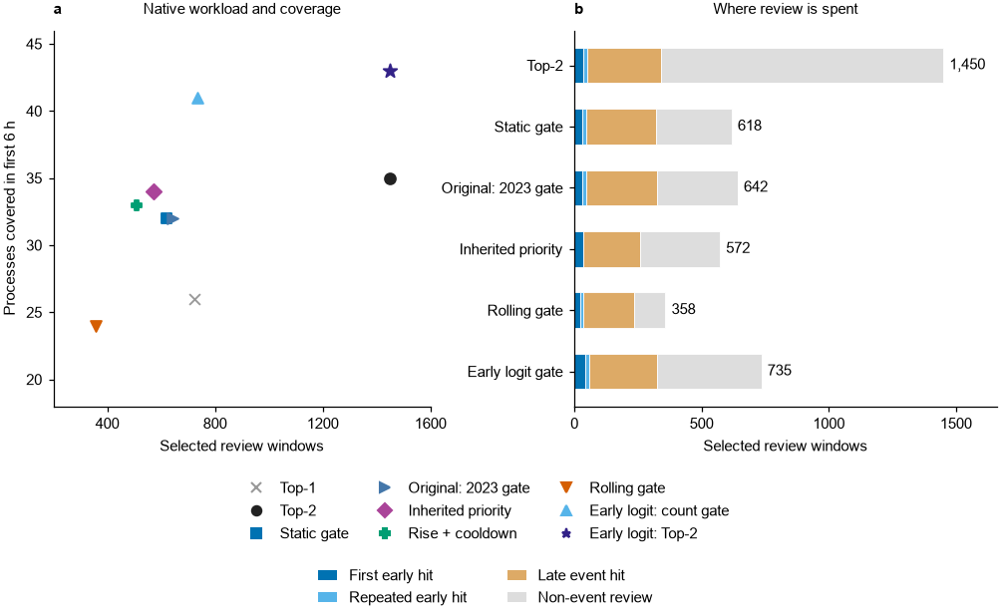
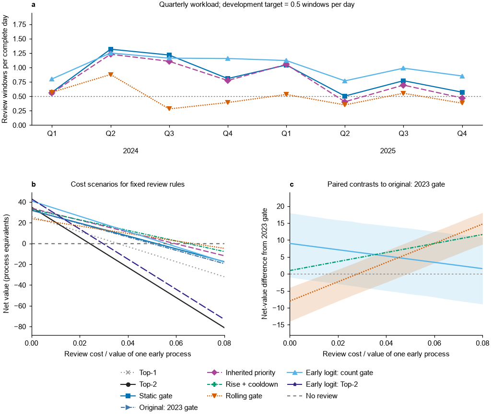
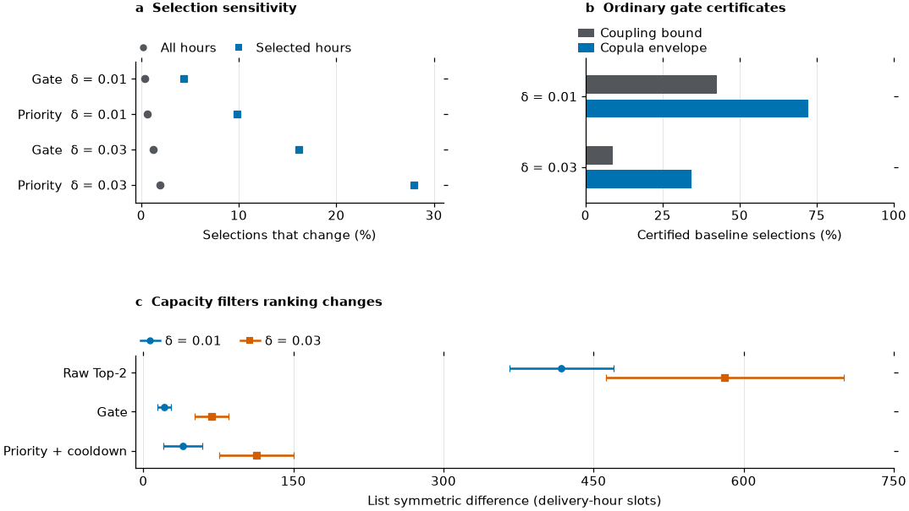
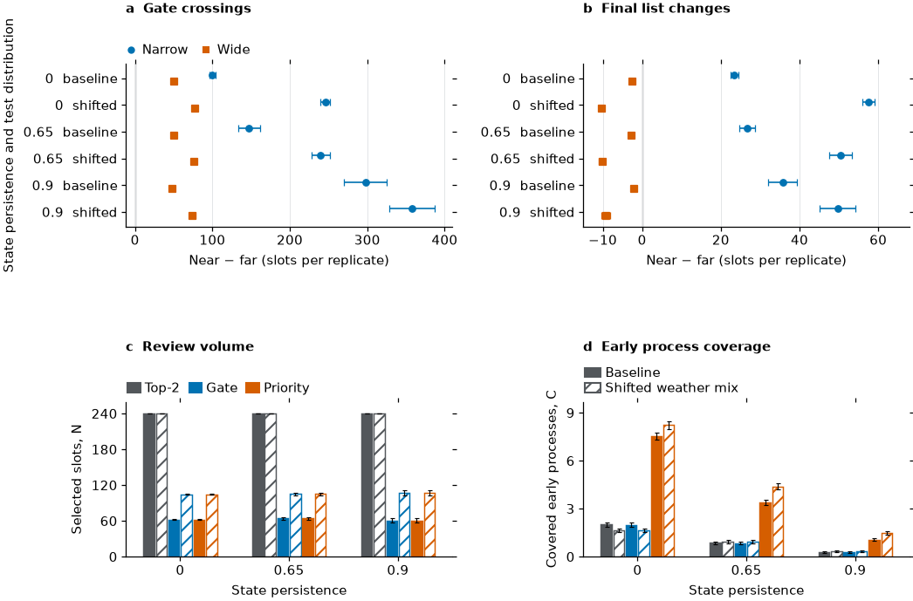

# From Joint Probability Forecasts to Selective Review: Decision Value and Calibration Sensitivity in Electricity Monitoring

Junjie Zhang¹,²*

¹ Shanghai Academy of Global Governance & Area Studies, Shanghai International Studies University, Shanghai 201620, China

² School of Economics and Finance, Shanghai International Studies University, Shanghai 201620, China

*Correspondence: junjiezhang2024@shisu.edu.cn. ORCID: https://orcid.org/0009-0004-8821-4018

Short title: Selective review of joint electricity forecasts

## Abstract

Probabilistic monitoring of interconnected electricity systems has to allocate limited review capacity as well as estimate joint risk. We study hourly synchronous high net load in Germany and Luxembourg, France and Belgium, and we separate three quantities a monitoring desk cares about: event hour hits, selected delivery windows, and coverage during a process's first six hours. A chronological post hoc reanalysis of 2024 to 2025 contains 17,400 scored hours and 71 processes. Selective gating moves selections from 1,450 to 618 and keeps 322 of the 341 event hours that daily Top2 finds, while early coverage moves from 35 to 32 processes. A forecast-only rolling gate approaches a mean target of 0.5 selections per day and recovers eight of those early discoveries. Under the same Top2 allocation, a logistic forecast built for early event hours covers 43 processes, against 38 for an otherwise identical hourly target model and 35 for the original joint forecast; year-specific results and conditional intervals qualify that pooled advantage. In a controlled comparison, selection stability rather than average score proves to be the binding constraint: local marginal-CDF stress scenarios change 16.2 percent of ordinary and 28.0 percent of stateful baseline selections. Known-mechanism simulations separate gate crossings from capacity competition, and Danish-pivotal endpoints with assumed availability price controls mark the reach of the transfer evidence. The contribution is an executable evaluation linking probability diagnostics, selection sensitivity and explicit process cost contracts, and reporting workload and early discovery together.

Keywords: probabilistic forecasting; selective review; net load; calibration sensitivity; temporal events

## 1 Introduction

A monitoring desk can receive a credible hourly risk forecast and still examine the wrong part of a developing episode. Weather links electricity demand and renewable supply across borders, creating periods when several regions have high net load together. European weather regime studies explain this coincidence and the duration of renewable shortages (van der Wiel et al., 2019; Bloomfield et al., 2020; Kittel and Schill, 2024). For a desk with limited review capacity, however, identifying another high risk hour late in an episode has a different value from identifying its first few hours. The forecasting target, the review contract and the evaluation endpoint must reflect that difference.

Regional net load forecasting has already moved beyond independent predictions. Browell and Fasiolo (2021) combine gridded weather forecasts with conditional extremes; Browell et al. (2022) study energy covariance structures. Gioia et al. (2025) develop additive covariance matrix models and evaluate regional net demand, aggregates and differences with operational relevance. Within electricity markets, Hirsch and Ziel (2024) model cross product dependence for simulation based intraday forecasting. These contributions make a new copula family an insufficient claim by itself. The practical question here is what a controlled dependence comparison changes when review slots are scarce, marginal probabilities remain uncertain and high risk hours arrive in persistent clusters.

Proper scores assess the quality of probabilistic predictions (Gneiting and Raftery, 2007a), while calibration and sharpness describe complementary properties (Gneiting et al., 2007b). Neither determines the value of a particular action without its cost and consequence. Cost loss evaluation formalizes this dependence (Murphy, 1977; Richardson, 2000), and different threshold weights can reverse forecast rankings (Ehm et al., 2016). Selective classification supplies an established language for allowing abstention (Franc et al., 2023). Our review decision is related but distinct: several named future hours can be selected from one issued trajectory, and repeated selections within a process may have little additional discovery value. Range oriented detection measures recognize this temporal structure (Tatbul et al., 2018).

Three gaps motivate the evaluation. First, a gate can appear better after retrospective workload equalization even though its actual list is a subset of daily Top2 and therefore loses some discoveries. Native allocation and hypothetical exposure standardization need separate interpretation. Second, a tiny Brier score difference can mask changed decisions around a gate or daily ranking boundary. Conditional marginal error must be propagated through selection, including the state of a cooldown rule; pooled calibration alone cannot certify that error is small. Third, ranking hourly event probabilities does not directly optimize discovery near onset. An elementary early target classifier with the same available predictors can test whether the target mismatch matters before proposing a more complex temporal model.

We address these gaps using issued probability streams and source provider records for Germany and Luxembourg, France and Belgium, followed by combinations replacing Belgium with either Danish zone. The analysis compares abstention, daily Top1/Top2, static and rolling gates, and separated temporal ranking mechanisms. It crosses an additional conditional marginal map with Gaussian and selected t dependence under the same correlation matrix, derives ordinary selection sufficient conditions from familiar probability bounds, and replays nine marginal stress paths for stateful decisions. Known probability simulations distinguish threshold crossing from capacity competition; direct early forecasting and price controls test two competing sources of decision information.

The resulting contribution is a decision evaluation with explicit benefit units, resource contracts and calibration sensitivity conditions. It does not depend on a new theorem or on declaring a universal winner. All added 2024 to 2025 comparisons are identified as reanalyses of previously inspected outcomes. The empirical target is a regional pressure indicator: simultaneous seasonal threshold exceedance warrants review, while reserve inadequacy, outages and realized response costs require additional system information.

## 2 Methods

### 2.1 The decision contract

For bidding zone measurement series j and UTC delivery hour t, net load is Yⱼₜ=Lⱼₜ−Wⱼₜ−Sⱼₜ, where demand, wind and solar generation follow the conventions of the source provider. The hourly monitoring event and its forecast are

Eₜ=1{Σⱼ1(Yⱼₜ>qⱼₜ)≥2},  pₜ=P(Eₜ=1 | ℱ_d). (1)

Here qⱼₜ is the seasonal 90th percentile reference and ℱ_d denotes information supplied to the forecast issued for target UTC day d. An exceedance requires a strict inequality. A review selects a named delivery hour window for examination. It does not imply that an employee spends one hour on it. We impose the daily cap Σₜ∈d aₜ≤K, with K=2, and permit a day with no selections. A long run mean target ρ=0.5 slots per complete forecast day is a separate resource contract; a daily cap alone does not impose that mean.

For equal additive value v from reviewing a true event hour and cost c per selection, the elementary expected value problem is

max Σₜ∈d aₜ(vpₜ−c), subject to aₜ∈{0,1}, Σₜ∈d aₜ≤K. (2)

With correct conditional probabilities and no interaction between reviews, one selects up to K largest probabilities above c/v; equality is an indifferent decision. This familiar threshold argument motivates a baseline. It does not establish an optimal rule when the first review of a developing process has greater value than another review late in the same process. Cost loss evaluation and selective prediction already provide the general foundations for such contracts (Richardson, 2000; Ehm et al., 2016; Franc et al., 2023).

Our primary outcome counts processes covered near their onset. An active day contains at least one observed event. Consecutive active days belong to one process, allowing at most one fully observed inactive day between them. An incompletely observed day breaks the process. This is an event day clustering rule, not an identification of meteorologically independent weather systems. For process s, τₛ is its first event hour and

Tₛ={t:τₛ≤t<τₛ+6 hours, Eₜ=1},  C(A)=Σₛ1{A∩Tₛ≠∅}. (3)

The endpoint excludes the hour at τₛ+6, and it counts a process only once. Onset is used to score a previously issued list, never to trigger it. We distinguish C from H(A)=ΣₜaₜEₜ, the number of event hour hits, and N(A)=Σₜaₜ, the number of selected slots. The process and hour utility scenarios are evaluated separately:

U_process/vₛ=C(A)−rₛN(A),  U_hour/vₕ=H(A)−rₕN(A), (4)

where rₛ=c/vₛ and rₕ=c/vₕ. Values and costs are scenario parameters, not estimated staffing or dispatch expenditures. Giving each process one unit values early discovery equally; severity weighted operational value would require a different agreed contract. Process oriented precision and recall already recognize front end preference and repeated detection (Tatbul et al., 2018).

### 2.2 Issued information and the controlled probability comparison

The original combination is Germany and Luxembourg, France and Belgium, denoted DE-LU/FR/BE. Regional electricity histories cover 2019 to 2025 and use SMARD, RTE and Elia records. Transfer replaces Belgium with DK1 or DK2 using Energinet series and local weather summaries. These are provider defined measurements: German grid load accounting excludes pumping and photovoltaic own consumption; French metropolitan load includes losses and excludes Corsica and pumping; the Belgian control area series includes Sotel; Danish processing treats renewable own consumption consistently before subtraction. Consequently, the target is coincidence of regional monitoring exceedances, not a sum of fully harmonized physical residual demand.

Thresholds are updated quarterly from a preceding three year window using calendar and trend terms. They exclude forecast weather and retain the measurement convention of their outcome series. Fixed offsets applied equally to observations and thresholds leave the label unchanged, whereas changing embedded generation, revisions and timestamp errors can change coincidence. Complete native records are required to aggregate an hour. All model variants use the same labels and eligibility masks. In 2024 to 2025 the original combination has 725 completely scored UTC days, 17,400 hours, 2,105 q90 event hours and 71 processes. Development in 2022 to 2023 has 715 completely scored days. The q95 reference is secondary.

The replay initializes the NOAA GEFS ensemble at D−1 00 UTC and issues the next UTC day's 24 probabilities at D−1 12 UTC, giving 12 to 35 hour leads. Twenty perturbed members supply regional temperature, land and marine wind, and radiation summaries. Member means and standard deviations enter the marginal and dependence models as covariates; the twenty members are not twenty separately fitted marginal distributions that are mixed afterwards. GEFS six hour endpoints are interpolated to delivery hours. This clock is a replay allowance. Revised electricity snapshots and initialization timestamps do not recover what was first publicly available on every historical day. The study therefore remains a delayed historical replay.

Quarterly expanding fits use history beginning in 2019. The raw regional distribution G is a regularized Gaussian location and scale additive model. The two marginal paths are F⁰(y)=B_daily(G(y)) and F¹(y)=B_cell(F⁰(y)), where the first beta PIT map is updated daily over mature observations and the second weekly within six fixed season/weather cells. The second map is fitted to PIT values already transformed by the first; insufficiently supported cells use B_cell(u)=u. The cell partition precedes this reanalysis. It uses the preceding 365 days; cells with insufficient support retain the identity map. The four configurations are M0, baseline margins and dynamic Gaussian copula; M1, additionally mapped margins and the same Gaussian copula; M2, baseline margins and selected Student t copula; and M3, mapped margins and the selected t copula. All share weather, physical thresholds, sample and dynamic correlation matrix Rₜ. The t degrees of freedom are selected from {3,5,8,15,30,∞} using development q90 Brier loss averaged over the two marginal paths; selection is chronological during development and the value fixed for 2024 to 2025 is three. This is a controlled family comparison under shared R, not separate unrestricted optimization of each family (Demarta and McNeil, 2005).

Correlation is fitted using issued PIT values and thirteen calendar/weather predictors, with a partial correlation parameterization ensuring positive definiteness. Marginal fitting and recalibration are distinct updates, not a single model frozen after 2021. Original quarterly threshold/correlation cutoffs are origin minus seven days, equivalent to 6.5 days before the first issue; daily and weekly maps use issue minus seven days. Newly fitted Danish components use fifteen day maturity. These lags are assumptions governing replay eligibility, not proof of historical publication vintages. Appendix S1 records exact windows, support requirements and update origins.

Let uⱼₜ=Fⱼₜ(qⱼₜ). The three dimensional event probability is calculated from pair and triple intersections:

pₜ=Σᵢ<ⱼP(Bᵢ=1,Bⱼ=1)−2P(B₁=B₂=B₃=1)=1−Σᵢ<ⱼCᵢⱼ(uᵢ,uⱼ)+2C₁₂₃(u₁,u₂,u₃), (5)

where Bⱼ=1(Yⱼ>qⱼ). Gaussian and t lower orthant CDFs are evaluated by deterministic correlation path integration. We assess stricter tolerance across every scored q90 hour and compare representative q90/q95 cases with independently randomized SciPy CDF calculations. Numerical reproducibility and numerical accuracy are treated separately.

### 2.3 Executable review rules and objective aligned forecasts

Top1 and Top2 select the highest one or two probabilities on each complete forecast day. A static gate selects at most two probabilities at least 0.25; its historical development criterion targeted at most 0.5 selections per complete forecast day in 2022. A second inherited rule uses threshold 0.19, six hour cooldown and rising risk ranking

bₜ=pₜ[1−max(pₜ₋₁,…,pₜ₋₆)]. (6)

Preceding values are issued forecasts, not observed events. The six hour cooldown rejects a target strictly less than six hours from an already planned target; an exact six hour separation is allowed. Selections are made for the whole next day and retain prior day planned state. Missing future labels never reset this state. Ties use descending ranking score, descending p and ascending UTC time. To separate the mechanisms, we cross ordinary/rising risk ranking with cooldown off/on at the common 0.25 threshold. The 0.19 cross is secondary. Rising risk is a heuristic score, not a probability that a process begins.

A rolling gate recalibrates the threshold from the preceding ninety complete forecast days, using only already issued probabilities. It chooses the threshold yielding the largest capped selection count no greater than 0.5 per past day from a fixed grid. There is a thirty day warm up and a 0.25 fallback. It uses no realized labels and is replayed chronologically. Future forecast distributions can change, so it neither promises an exact annual quota nor retrospectively trims excess selections. Each of M0 to M3 is evaluated at a common 0.25 gate and a model specific gate chosen from 2022 probability counts; 2023 documents development behavior.

To test whether the target itself matters, we fit regularized logistic models with identical available covariates and two different labels: Eₜ and Zₜ=1{t∈Tₛ for some s}. The second predicts an event hour within a process's initial six hours. Inputs include the issued probability trajectory within the same target day, its rise and daily summaries, forecast weather and calendar. No actual target day load, preceding realized event, or next day unissued forecast enters either model. Standardization is fitted in 2022; penalty selection uses 2023 validation labels only when their interval ends have matured before the first 2024 issue, under the same seven/fifteen day rule; subsequent quarterly expanding updates refit the imputer, standardizer and coefficients on the eligible expanding history, retain the selected penalty, and apply hour_end+7 days≤issue in the original combination and hour_end+15 days≤issue for newly fitted Danish models. Native Top2 gives an equal workload comparison. Primary count gates use the same issued 2023 validation days and a common threshold grid, keeping thresholds appropriate to the different probability scales. These validation forecasts use 2022 parameter fits, while 2023 also selects the penalty; the period is development, not an independent test. The 2022 count contract is secondary and its newly fitted classifier probabilities are explicitly training distribution predictions. All fit origins, sample support and choices are saved.

For Denmark, price only, probability only and combined logistic controls use the same calendar and temporal development scheme, for both hourly and early labels. Price sorting supplies an additional simple comparator. This is an assumed availability sensitivity: current official price snapshots lack first publication vintages. Moreover, the UTC target day extends beyond the locally auctioned delivery day. At the issue, prices are supplied only for Copenhagen delivery dates no later than the next local day; the remaining one or two UTC evening hours receive a missing price indicator and training based imputation. They cannot enter direct price sorting. After September 2025 quarter hour DayAheadPrices are averaged only when all four periods exist. This comparison tests incremental ranking conditional on the stated price assumption, not real time market advantage.

### 2.4 Marginal perturbations and selection stability

PIT or pooled frequency calibration does not certify every threshold probability or every weather conditioned hour (Gneiting et al., 2007b; Ziegel and Gneiting, 2014). We report cell mean exceedance residuals and the distribution of Fⱼₜ(qⱼₜ), then propagate explicit perturbations to decisions. The fixed copula coupling argument gives

|p(u′)−p(u)|≤Σⱼ|u′ⱼ−uⱼ|. (7)

Couple both events to one copula uniform vector: a change requires at least one component to fall between its two thresholds; a union bound proves (7). This elementary inequality is not a new theorem. For the numerical box u′ⱼ∈[max(ε,uⱼ−δ), min(1−ε,uⱼ+δ)], ε=10⁻¹², risk has exact fixed copula monotone endpoints p(u+δ)≤p(u′)≤p(u−δ), with the endpoint vectors clipped to the same box. We use δ=0.01 and 0.03 as declared local stress magnitudes. They are not estimated hourly confidence radii, and some development cell mean residuals are larger.

Ordinary top K gating depends on threshold and rank. Write each hour's risk interval [pₜ⁻,pₜ⁺]. A selected hour is sufficiently certified if

pₜ⁻≥g and #{j≠t within the day:pⱼ⁺≥pₜ⁻}<K. (8)

An unselected hour is certified if pₜ⁺<g, or K other hours have lower risks strictly above its upper risk. The inclusive comparison in the first count conservatively handles ties. We implement both the coupling envelope and the tighter fixed copula monotone envelope. These are certificates conditional on the assumed box and ordinary allocation, not certificates of calibration.

For the stateful rule, all eight constant regional sign combinations plus the baseline are replayed over the full 2022 to 2025 sequence, before scoring 2024 to 2025. We record gate crossings, raw Top2 ranking changes, final list changes and process coverage. Scenario invariant, scenario critical and continuously certified mean different things. Nine constant shift paths cannot certify all possible time varying perturbations of a cooldown policy. A changed early selection can also alter a later rejection, which requires replay rather than editing an already chosen list.

### 2.5 Evaluation and uncertainty

We score the common four model domain using Brier loss, reliability support and the native N, H and C. Forecast completeness governs allocation; complete outcome days govern scoring afterwards. Reliability bins disclose numbers of hours and event days, since thin support limits fine conditional interpretations and arbitrary bin choices affect reliability displays (Dimitriadis et al., 2021). Process boundaries near missing observation days or evaluation edges are flagged. Gap zero/two and q95 sensitivity retain the same policy parameters unless explicitly labeled a separately development calibrated resource contract.

Cost curves include no review and all competitive rules. The cost grid is fixed for the reanalysis; it is not searched for a favorable operating point. Synchronized fourteen calendar day moving blocks within year/quarter give 2,000 draws for primary native, cost and early target contrasts; the complete auxiliary early/price cost grids use 1,000 draws, with counts recorded separately. Process reward is assigned intact to the onset day, selection cost to the target day. This preserves original process membership rather than reconnecting duplicated blocks. Intervals condition on fitted probability streams, parameters and realized boundaries. They omit uncertainty from refitting the original forecasting pipeline. Curve summaries distinguish pointwise intervals from simultaneous bands over the declared grid for one policy or paired contrast; they do not establish joint dominance across every model, rule and cost.

We retain the earlier uniform retention comparison only as exposure standardization. If N originally selected slots contain m relevant early slots for a process, retaining B uniformly without replacement gives

P(early coverage after retention)=1−choose(N−m,B)/choose(N,B). (9)

The convention covers m=0 and B=N. It is an exact expected value under a hypothetical randomization, not a deployed annual controller. Choosing B as the smallest observed policy count is also an evaluation choice, not an externally supplied operational budget. Native and standardized results therefore remain separate.

### 2.6 Mechanistic simulations and transfer endpoints

Known probability stress tests follow ADEMP and report Monte Carlo standard errors (Morris et al., 2019). Three regional exceedances have common conditional marginal probability z. With probability w=0.30 they share one uniform draw; otherwise their uniforms are independent, giving

p_true=wz+(1−w)(3z²−2z³). (10)

A three state observed weather process modulates z across 120 day paths. Persistence is 0, 0.65 or 0.90 with a common stationary distribution; a second stationary mixture changes the proportion of higher risk weather. These are separate distribution scenarios, not an untested simulation of a successfully adaptive controller. We compare known correct probabilities, an independence approximation and regional marginal shifts of equal magnitude and number placed near or far from the gate. The near/far draws share the same labels and random path. They change probabilities before allocation; no statistical model is fitted in this fixture. Narrow and wider boundary regimes assess when gate crossings survive daily capacity competition. Each main regime has 400 replications; paired differences use replicate level standard deviations divided by √400. Simulation amendments and the initial exploratory fixture are documented in Appendix S1.

An independent two hour fixture holds hourly probabilities at 0.4 while changing temporal occurrence from shared to independent. It illustrates why spatial hourly probabilities do not identify at least one detection across time. A separate isolated hour phase fixture contrasts an observed phase signal with noise; it is not an empirical process forecast result. In the Danish transfer, 924 q90 event hours are shared German and French exceedances in both combinations. We also evaluate Danish pivotal hours, where Denmark is needed for the joint event. Two definitions are disclosed: pivotal hits within the first six hours of the parent joint process, and processes reclustered from the pivotal subset. Review cost always counts the entire issued list, not only retrospectively successful Danish slots.

## 3 Results

### 3.1 Selectivity removes quiet hour work while losing some early discoveries

The static gate compresses workload strongly but cannot increase native coverage relative to Top2: with the same probabilities and ties, its list is a subset. Top2 selected 1,450 slots, hit 341 event hours and covered 35 of 71 early processes. The gate selected 618 slots, hit 322 event hours and covered 32 processes (Table 1). The 832 removed slots comprise 19 event hours and 813 quiet hour hours, a removed slot event rate of 2.28%. Thus 94.4% is retention of event hours already found by Top2, whereas total event hour recall is 322/2,105=15.3%. The reduction of 57.4% in selected windows is accompanied by early coverage falling from 49.3% to 45.1%.

Table 1. Native q90 review outcomes in the original combination, 2024 to 2025.

| Rule | Slots N | Event hits H | Early processes C | Coverage (%) | Slots/day |
| --- | --- | --- | --- | --- | --- |
| No review | 0 | 0 | 0 | 0.0 | 0.000 |
| Top1 | 725 | 179 | 26 | 36.6 | 1.000 |
| Top2 | 1450 | 341 | 35 | 49.3 | 2.000 |
| Static gate 0.25 | 618 | 322 | 32 | 45.1 | 0.852 |
| Rise/cooldown 0.19 | 572 | 259 | 34 | 47.9 | 0.789 |
| Cooldown 0.25 | 500 | 264 | 31 | 43.7 | 0.690 |
| Rise ranking 0.25 | 618 | 272 | 32 | 45.1 | 0.852 |
| Rise/cooldown 0.25 | 509 | 253 | 33 | 46.5 | 0.702 |
| Rolling count gate | 358 | 234 | 24 | 33.8 | 0.494 |
| Original: 2023 gate | 642 | 324 | 32 | 45.1 | 0.886 |
| Hourly target: 2023 gate | 823 | 341 | 37 | 52.1 | 1.135 |
| Early target: 2023 gate | 735 | 324 | 41 | 57.7 | 1.014 |
| Hourly target: Top2 | 1450 | 349 | 38 | 53.5 | 2.000 |
| Early target: Top2 | 1450 | 340 | 43 | 60.6 | 2.000 |

All rules share 725 scored complete UTC days, 2,105 event hours and 71 processes. The cap is two slots per day; count gates share a development mean target, not an identical realized workload. Native early discovery never uses an observed onset to trigger selection.

The decomposition explains what an hourly hit count obscures (Figure 1). Top2's 341 hits include 35 first early detections, 16 additional early selections within already covered processes and 290 late event selections. The gate retains 32, 15 and 275 respectively. The inherited rising risk/cooldown rule has 34 first early detections, no repeated early selections, 225 late hits and 313 quiet hour selections. It emphasizes a different outcome even though its hourly precision is lower. Under process value, the inherited rule's 572 slots and 34 early detections point dominate the gate's 618 and 32; under hour value, the gate's additional 63 hits matter. There is no objective independent best rule.

The three early processes lost by gating all occurred in 2024. One began on 9 January at 14 UTC and lasted through 19 January, containing 129 event hours. Its first six hour maximum forecast risk was only 0.1073; France exceeded its reference by up to 5,705 MW among the early joint event hours. The gate found nine later event hours, but not its early phase. The other lost processes began on 8 April at 06 UTC, with four event hours, and 7 October at 15 UTC, with one. Their early maximum risks were 0.2210 and 0.0880. Saved selections should therefore not be described as removing only unimportant events. Appendix S1 lists all three histories and flags their measurement interpretation.

Figure 1. Native review workload and early coverage. Outcomes cover 725 complete UTC days and 71 q90 processes. First early hits count distinct processes; repeated early hits, late event hits and quiet hour selections are mutually exclusive and sum to N. Newly fitted count gates use 2023 validation forecast distributions; historical gates retain their earlier development contracts.

### 3.2 Resource adaptation and temporal ranking solve different problems

A fixed gate does not hold its development workload target. In reanalysis it averages 0.852 slots per scored day, 70.5% above 0.5. The rates are 0.981 in 2024 and 0.724 in 2025. It leaves 55.3% of days unselected and reaches the two slot cap on 40.6%. The rolling forecast only gate averages 0.494 slots per day, with yearly rates 0.532 and 0.456, and leaves 73.4% of days unselected. Its closer workload control is paid for by 24 rather than 32 early discoveries: the paired difference is −8 processes, with a conditional 95% interval [−14,−4]. Quarterly trajectories and cost curves are shown in Figure 2. Greater selectivity is not free.

At the common 0.25 gate, cooldown alone gives 500 slots and 31 early discoveries; rising risk alone gives 618 and 32; together they give 509 and 33. This separates suppression and ranking from the lower inherited threshold. The combined common threshold increment over the static gate is one process [−5,11], while the inherited 0.19 rule adds two [−5,13] with 46 fewer slots. The inherited rule covers eight more early processes than the gate in 2024 but six fewer in 2025. Its point advantage remains relevant to a process cost decision, yet the available years do not establish a stable incremental discovery rate.

For the static gate versus Top2, ΔU_process/vₛ=−3+832rₛ; the pairwise switch occurs at rₛ=3/832≈0.00361. This crossing is not the frontier over all alternatives. For example, at rₛ=0.005 the respective utilities of Top2, gate, inherited priority, common threshold rise/cooldown and rolling are 27.75, 28.91, 31.14, 30.46 and 22.21. The policy ranking changes when one values H rather than C. Complete curves include abstention and uncertainty instead of choosing one convenient cost. A resource manager must specify the benefit unit and whether 0.5 slots/day is a planning target or a constraint before selecting a rule.

The direct early target experiment changes the ranking without changing the daily Top2 workload. It covers 43 processes, against 38 for the same feature hourly target logistic model and 35 for the original joint forecast; hourly hits are 340, 349 and 341, respectively. The paired early target minus hourly target increment is five processes, with a conditional 95% interval [−3,13]. Relative to the original forecast, the increment is eight [−1,17]. The pooled difference is informative as a target alignment check, but does not establish a stable superiority.

For the common 2023 development resource contract, the original, hourly target and early target gates are 0.23, 0.05 and 0.02. They selected 175, 173 and 175 slots in 357 validation forecast days. In reanalysis, they select 642, 823 and 735 slots and cover 32, 37 and 41 processes. Thus the early forecast adds nine discoveries [−1,18] relative to the original while adding 93 slots [54,130]. Relative to the same feature hourly model, it uses 88 fewer slots [−113,−71] and adds four discoveries [−4,13]. A common development mean target does not produce equal realized workload under shift. In 2024, the early gate covers 25 of 39 processes versus 15 for the original; in 2025 it covers 16 of 32 versus 17. The same feature hourly gate covers 19 and 18. Figure S2 and Table S7 retain these annual contrasts.

The early classifier's Brier loss for its own early hour label is 0.012313. For the general hourly event label its loss is 0.109771, compared with 0.062902 for the hourly logistic control and 0.060191 for M0. These are different probability tasks: the early forecast is useful for examining target aligned ranking, rather than replacing a general joint event forecast. Quarterly scores, calibration support and conditional contrasts are included in Appendix S1.

Figure 2. Workload drift and process cost scenarios. Quarterly allocations retain their native lists. Process utility is C−rN, including no review; the displayed range is a scenario comparison rather than a deployable optimal frontier. The paired contrast reference is the original forecast with its 2023 count gate, 0.23. Shading gives pointwise conditional 95% intervals from 2,000 synchronized fourteen day block draws; it does not include model refitting. Full cost grids and single contrast simultaneous bands are archived.

### 3.3 Average forecast changes and selection changes have different scales

Additional marginal mapping improves development q90 Brier loss from 0.029064 to 0.028552, but reanalysis loss rises from 0.060191 to 0.060598. Regional marginal and joint diagnostics do not provide interchangeable evidence of improvement. The event rate itself changes from 3.93% in development to 12.10% in reanalysis. At the common gate, M0 to M3 select 618, 619, 616 and 613 slots and cover 32, 31, 31 and 31 early processes (Table 2). The model specific q90 count gates all remain 0.25, so the absence of a decision gain is not caused here by denying one stream development retuning. At q95, development count gates differ and are reported separately.

Table 2. Controlled marginal map × copula family comparison.

| Model | Margins / family | Development BS | Reanalysis BS | Slots N | Hits H | Early C |
| --- | --- | --- | --- | --- | --- | --- |
| M0 | Baseline / Gaussian | 0.029064 | 0.060191 | 618 | 322 | 32 |
| M1 | Mapped / Gaussian | 0.028552 | 0.060598 | 619 | 327 | 31 |
| M2 | Baseline / selected t | 0.029071 | 0.060186 | 616 | 320 | 31 |
| M3 | Mapped / selected t | 0.028557 | 0.060579 | 613 | 326 | 31 |

Brier scores refer to the same hourly q90 event. Allocations use the common 0.25 gate. All configurations share the dynamic correlation matrix, weather covariates, event labels and observation masks. Development covers 2022 to 2023; reanalysis covers 2024 to 2025.

For mapped margins, t minus Gaussian Brier loss is −0.00001926, with a fourteen day block interval of [−0.00011324,0.00003494] under the present synchronized bootstrap. With baseline margins the difference is smaller. These estimates describe the selected three degree of freedom family under shared R. They neither prove that tail dependence is absent nor compare all optimally fitted t models. Seasonal q90 is also not uniformly a conditional tail threshold: in the baseline marginal forecasts F(q90)<0.9 occurs in 27.8%, 37.2% and 35.2% of original region test hours; F(q90)<0.5 occurs in 9.2%, 14.7% and 11.9%. A high seasonal net load reference can become quite ordinary in the issued weather state.

Numerical checks support interpreting the small contrast as a property of this fitted comparison rather than the tested integration tolerance. Across all 17,400 scored q90 hours, tightening integration from 10⁻⁹ to 10⁻¹¹ changes Brier loss by at most 2.04×10⁻¹⁵ and changes none of the eight model/rule lists. Ninety six stratified Gaussian/t q90/q95 cases compared with three seed independent randomized CDF calculations have a maximum reference mean discrepancy of 2.56×10⁻⁷. This is evidence of numerical convergence and cross method agreement, not statistical equivalence.

Small average score differences still permit changed decisions. Among 326 baseline hours within 0.02 of the 0.25 gate, the mean absolute Gaussian to t probability difference is 0.00498 and the maximum is 0.01965. There are 38 gate crossings and an 18 hour symmetric difference between final ordinary lists; native early coverage changes from 32 to 31. A negligible average increment cannot be translated into an assertion that the chosen hours are identical.

Selection sensitivity is concentrated within chosen hours rather than the full hourly series (Figure 3). Across the central path and eight constant regional CDF shift paths with δ=0.03, 219 ordinary rule hours and 333 stateful rule hours change membership. These are only 1.26% and 1.91% of all scored hours, but include 16.18% and 27.97% of the baseline selected lists. Ordinary early coverage ranges from 31 to 33 processes; inherited stateful coverage ranges from 34 to 36. With δ=0.01, the corresponding baseline selected fractions are 4.37% and 9.79%.

Continuous box sufficient conditions are stricter than observed invariance across nine paths. For the ordinary gate at δ=0.03, the coupling condition certifies 54 of 618 baseline selections and the monotone condition certifies 212; these selected subsets cover five and sixteen early processes. At δ=0.01, the counts are 264 and 447, covering nineteen and twenty eight. The conditions offer usable conditional checks for ordinary allocation, but the declared boxes are not justified hour specific error bounds. For the stateful rule, finite scenario replay reports sensitivity rather than a continuous box certificate. Raw Top2 rankings also change on hours later excluded by gating, so counting raw ranking changes alone exaggerates allocation consequences.

Figure 3. Marginal stress and decision stability. Scenario critical hours are the union of changes across the central path and eight constant regional CDF shift paths. Counts are shown relative to all scored hours and to the baseline selected list. Continuous box sufficient conditions apply only to ordinary top two gating, conditional on an assumed δ box. Raw Top2 ranking changes and final gated list changes are separately shown; the horizontal ranges span eight corner paths and their markers denote range midpoints, not uncertainty intervals. Scenario invariance of the cooldown rule is not a continuous box certificate.

### 3.4 Known mechanisms distinguish threshold sensitivity from capacity competition

The simulation reveals when the location of marginal error matters and when it does not (Figure 4). In the narrow boundary baseline mixture at persistence 0.65, near- and far gate perturbations have exactly the same regional marginal mean absolute error, approximately 0.001692. Near gate perturbations produce 147.5 gate crossings per 120 day path and 27.9 changed selected slots; far gate perturbations produce no gate crossings and 1.2 changed slots. Their Brier losses are nevertheless very close, 0.053377 and 0.053382. Early process coverage is lower by 0.09 under the near perturbation, a small change compared with the much larger number of hourly threshold changes. Paired replicate contrasts and Monte Carlo standard errors are provided in Appendix S1.

The wider boundary fixture supplies a useful counterexample: near gate changes can be dominated by higher probability competitors under K=2, so they do not necessarily change the final list. A missed shared shock dependence component can similarly create many threshold crossings without changing the daily top two. Persistence and the higher risk stationary mixture alter workload and the number of distinct early opportunities even with known probabilities. The simulations thus support inspecting gate, rank and process consequences separately; they do not establish a universal ordering of near versus far error or of static versus adaptive policies.

The two hour fixture estimates at least one occurrence at 0.3968 under shared occurrence and 0.6416 under independent occurrence, against true values 0.4 and 0.64; Monte Carlo standard errors are 0.00160 and 0.00153. Identical hourly probabilities therefore leave temporal coverage unidentified. An observed synthetic phase signal can identify an isolated hour, whereas a randomized phase cannot. That information contrast is kept distinct from the empirical early classifier and from the active day process definition.

Figure 4. Known probability simulations separate threshold crossings from selected list changes. Narrow and wide boundary regimes use matched regional marginal error and common random paths; paired contrasts show Monte Carlo SE. Oracle workload and early coverage vary with weather persistence and a separately changed stationary weather mixture. Each regime has 400 replications of 120 days. All panels are synthetic, with known probabilities; no empirical forecasting improvement is inferred from them.

### 3.5 Transfer and market information delimit the application

DK1 and DK2 combinations share all 924 German and French q90 joint exceedance hours, representing 56.3% and 50.6% of their 1,641 and 1,826 events. Their evidence is partly shared. When Denmark is pivotal, 717 and 902 hours remain. At parent process onset there are 45 and 54 opportunities with a pivotal event in the initial six hours. Top2 covers 22 and 29, the static gate 21 and 23, inherited priority 19 and 23, and rolling allocation 16 and 17. No cost is removed merely because a selected slot later proves not pivotal. Reclustering the pivotal subset produces 63 and 76 processes with different onsets; both definitions and their costs are reported (Table 3).

Table 3. Danish pivotal early coverage under two process definitions.

| Zone | Rule | All slots N | Parent onset C/opportunities | Reclustered C/processes |
| --- | --- | --- | --- | --- |
| DK1 | Original Top2 | 1450 | 22/45 | 26/63 |
| DK1 | Static gate 0.25 | 469 | 21/45 | 24/63 |
| DK1 | Rise/cooldown 0.19 | 432 | 19/45 | 25/63 |
| DK1 | Rolling count gate | 360 | 16/45 | 19/63 |
| DK2 | Original Top2 | 1450 | 29/54 | 36/76 |
| DK2 | Static gate 0.25 | 517 | 23/54 | 27/76 |
| DK2 | Rise/cooldown 0.19 | 492 | 23/54 | 29/76 |
| DK2 | Rolling count gate | 355 | 17/54 | 19/76 |
| DK1 | Risk/calendar Top2 | 1450 | 22/45 | 25/63 |
| DK1 | Price/risk/calendar Top2 | 1450 | 25/45 | 30/63 |
| DK2 | Risk/calendar Top2 | 1450 | 30/54 | 36/76 |
| DK2 | Price/risk/calendar Top2 | 1450 | 35/54 | 40/76 |

The parent onset definition preserves the original joint process start; the pivotal reclustered definition forms new processes from Danish pivotal hours. Cost includes every issued review slot. Price/risk comparisons assume the price availability stated in Section 2.3.

Under the stated price availability assumption, raw price Top2 covers 24 of 71 DK1 processes and 22 of 75 DK2 processes, below the original forecast's 35 and 40. Comparing combined price/risk logistic forecasts with probability/calendar logistic controls isolates conditional price information more fairly. Combined hourly target Top2 covers 40 versus 35 DK1 processes and 48 versus 41 DK2 processes at the same 1,450 slots. The paired increments are five [−1,12] and seven [2,13]. These auxiliary comparisons across zones and targets are not multiplicity adjusted evidence of a general price advantage. They depend on assumed price availability and a current snapshot. The allocation excludes unavailable prices for the next local day and the day after from direct sorting; 1,151 scored UTC evening hours per zone are masked in 2024 to 2025.

On Danish pivotal hours within parent onsets, the combined hourly forecast covers 25 of 45 DK1 opportunities and 35 of 54 DK2 opportunities, versus 22 and 29 for the original forecast. Reclustering pivotal events instead gives 30 of 63 and 40 of 76, versus 26 and 36. The different denominators represent different discovery questions, with full list cost retained in both.

These transfers test replacement zone measurements and local forecast weather while keeping German and French components. They do not constitute independent three zone replications. Changing the event to q95 also changes the policy trade off: in the original combination, ordinary gate 0.25 covers 25 of 61 processes in 405 slots, whereas the same gate with cooldown alone covers 31 in 310. A temporal heuristic that has an uncertain q90 increment can be competitive under a different threshold and endpoint. The supplement retains this boundary instead of summarizing all robustness checks as uniformly favorable.

## 4 Discussion

A joint probability forecast and a review policy answer different questions. The forecast asks how likely simultaneous high net load is in a specified hour. The review contract asks what that hour contributes when capacity is limited, examining it has a cost, and another hour in the same process may already have been covered. Our main empirical result is a set of explicit, reproducible trade offs: large reductions in quiet hour selections, real losses of early discovery under a strict mean workload target, objective dependent ranking of temporal rules, and changes in selected hours despite nearly unchanged average probabilistic scores.

This result builds on, rather than replaces, mature dynamic covariance forecasting. Gioia et al. (2025) evaluate both multivariate scores and operationally motivated regional aggregates and differences. Hirsch and Ziel (2024) model cross product dependence in electricity markets. The narrower addition here is to evaluate selection under a declared review contract, trace calibration sensitivity through actual allocation and compare a direct early window target with an hourly event target using the same available covariates. The elementary probability bound, cost threshold and range oriented endpoint provide foundations; their empirical implementation and limits carry the contribution.

Static gating is attractive when the existing probability ranking discriminates low risk days and the available workload can follow changes in forecast risk. Rolling count calibration is useful when mean selection volume is the binding planning objective, but its coverage cost must be measured. Temporal dispersion and early target learning are relevant when repeated late hour reviews have little additional benefit. A cooldown heuristic does not substitute for calibrated onset information: its state can amplify a changed early selection, and its performance can reverse across years or physical monitoring thresholds. A dedicated early classifier addresses the target directly without claiming a full temporal generative model or an optimal set policy.

The stability analysis also places a limit on attribution. Local CDF perturbations can leave aggregate scores almost unchanged while moving relevant selections. Conversely, a raw ranking change on a quiet day can disappear after gating. The monotone copula envelope offers more informative ordinary selection conditions than a union bound, but both depend on an assumed marginal error box. Development weather cell mean residuals reach about 0.145 in some cells, well beyond the local 0.01/0.03 stress magnitudes. These calculations cannot declare that actual marginal error is sufficiently small to attribute a realized improvement safely to dependence. They show how to test a specified perturbation and where available calibration evidence does not justify certification.

### 4.1 Scope and limitations

The 2024 to 2025 forecasts and the Danish extensions had been inspected before these comparisons were designed. The added comparisons are therefore chronological reanalyses tuned on development data, and they carry the status of a development evaluation rather than that of a fresh holdout. Fixed stream bootstrap intervals omit uncertainty from earlier model fitting and selection; quarterly refitting of the new logistic models improves the operational replay but does not change that retrospective status. Weather cell residuals and thin reliability bins cannot certify hour specific conditional probabilities. Two years with 71 original processes constrain claims about year to year stability, and the equal process value does not capture severity or all operational consequences.

Historical snapshots can contain revisions; assumed maturation delays do not recreate live information. The price comparisons further depend on assumed release availability and exclude delivery hours beyond the auctioned local day. Source accounting and the Belgian Sotel overlap constrain literal bidding zone comparability, and Danish combinations share German and French evidence. Finally, no control room staffing, response, reserve adequacy or outage outcomes were measured. Selected delivery windows are review opportunities. A prospective shadow log of input arrival, revisions, forecasts and selections, followed by enough new event processes and an agreed review cost contract, would be the appropriate next validation.

## 5 Conclusion

Selective review should be evaluated as a decision made from a joint forecast. A static gate removed 813 quiet hour selections while losing three early processes; a rolling workload gate met a tighter mean target while losing another eight. Temporal rules and early target forecasts change that trade off, and small probability score contrasts do not guarantee stable review lists. Reporting native workload, early coverage, cost scenarios and selection sensitivity together makes these differences visible. The evidence supports a transparent monitoring evaluation for the studied regional records; it does not identify a universally optimal rule or establish live operational savings.

## Author contributions

Junjie Zhang: conceptualization, methodology, software oversight and validation, formal analysis, investigation, visualization, writing and revision. The author takes responsibility for the data processing, code, calculations and manuscript.

## Funding and competing interests

No external funding was received. The author declares no competing interests.

## Ethics statement

The study uses public electricity and weather records and simulations. It involves no human participants, personal participant data or animal experiments; participant consent and human subject ethics review are not applicable.

## Data and code availability

The research code and the derived evaluation data that support this study are openly available in Zenodo, version 1.1.2, DOI 10.5281/zenodo.23230336 (concept DOI 10.5281/zenodo.23100588 for all versions). That record contains the revision pipeline and the derivative evaluation tables for the selective review comparisons, the policy and cost analysis, the marginal perturbation screens, the known mechanism simulations and the transfer endpoints, together with parameter logs and the numerical ledger. An earlier release of the same archive remains available under the same concept DOI. Provider material stays subject to its source terms, and the package distinguishes evaluation on the fixed forecast streams from the complete source data refitting pipeline.

## Use of AI tools

OpenAI Codex was used only for limited Python code assistance and English language polishing. All substantive research tasks, including study design, data collection and processing, analysis, interpretation, and manuscript preparation, were performed by the authors. AI did not generate or alter data or determine conclusions, and the authors take full responsibility for the manuscript.

## Supporting information

Appendix S1 contains detailed forecast/update specifications, data timing and eligibility, full policy and cost tables, numerical integration checks, perturbation certificates and scenario paths, simulation designs and Monte Carlo precision, targeted early and price analyses, and Danish pivotal endpoint definitions. Figures S1 and S2 and Tables S1 to S12 are supplied with Appendix S1. Reproduction scripts and permitted derivative evaluation tables accompany the article package.

## References

Bloomfield, H. C.; Suitters, C. C.; Drew, D. R. (2020). Meteorological Drivers of European Power System Stress. J. Renewable Energy, 2020, 5481010. [Source](https://doi.org/10.1155/2020/5481010).

Browell, J.; Fasiolo, M. (2021). Probabilistic Forecasting of Regional Net-Load with Conditional Extremes and Gridded NWP. IEEE Trans. Smart Grid, 12(6), 5011–5019. [Source](https://doi.org/10.1109/TSG.2021.3107159).

Browell, J.; Gilbert, C.; Fasiolo, M. (2022). Covariance Structures for High-Dimensional Energy Forecasting. Electr. Power Syst. Res., 211, 108446. [Source](https://doi.org/10.1016/j.epsr.2022.108446).

Demarta, S.; McNeil, A. J. (2005). The t Copula and Related Copulas. Int. Stat. Rev., 73(1), 111–129. [Source](https://doi.org/10.1111/j.1751-5823.2005.tb00254.x).

Dimitriadis, Timo; Gneiting, Tilmann; Jordan, Alexander I. (2021). Stable reliability diagrams for probabilistic classifiers. Proceedings of the National Academy of Sciences, 118(8), e2016191118. [Source](https://doi.org/10.1073/pnas.2016191118).

Ehm, Werner; Gneiting, Tilmann; Jordan, Alexander; Krüger, Fabian (2016). Of Quantiles and Expectiles: Consistent Scoring Functions, Choquet Representations and Forecast Rankings. Journal of the Royal Statistical Society: Series B (Statistical Methodology), 78(3), 505–562. [Source](https://doi.org/10.1111/rssb.12154).

Energinet (2026). Energy Data Service Terms and Conditions. Energinet, Fredericia, Denmark. [Source](https://www.energidataservice.dk/terms-and-conditions).

Energinet (2026). ProductionConsumptionSettlement: Dataset and Field Metadata. Energinet, Fredericia, Denmark. [Source](https://api.energidataservice.dk/meta/dataset/ProductionConsumptionSettlement).

Energinet (n.d.). Day-Ahead Prices: Dataset Metadata. Energinet, Fredericia, Denmark. [Source](https://api.energidataservice.dk/meta/dataset/DayAheadPrices).

Franc, Vojtech; Prusa, Daniel; Voracek, Vaclav (2023). Optimal Strategies for Reject Option Classifiers. Journal of Machine Learning Research, 24(11), 1–49. [Source](https://jmlr.org/papers/v24/21-0048.html).

Gioia, V.; Fasiolo, M.; Browell, J.; Bellio, R. (2025). Additive Covariance Matrix Models: Modeling Regional Electricity Net-Demand in Great Britain. J. Am. Stat. Assoc., 120(549), 107–119. [Source](https://doi.org/10.1080/01621459.2024.2412361).

Gneiting, T.; Balabdaoui, F.; Raftery, A. E. (2007b). Probabilistic Forecasts, Calibration and Sharpness. J. R. Stat. Soc., Ser. B, 69(2), 243–268. [Source](https://doi.org/10.1111/j.1467-9868.2007.00587.x).

Gneiting, T.; Raftery, A. E. (2007a). Strictly Proper Scoring Rules, Prediction, and Estimation. J. Am. Stat. Assoc., 102(477), 359–378. [Source](https://doi.org/10.1198/016214506000001437).

Hirsch, Simon; Ziel, Florian (2024). Multivariate simulation-based forecasting for intraday power markets: Modeling cross-product price effects. Applied Stochastic Models in Business and Industry, 40(6), 1571–1595. [Source](https://doi.org/10.1002/asmb.2837).

Kittel, M.; Schill, W.-P. (2024). Measuring the Dunkelflaute: How (Not) to Analyze Variable Renewable Energy Shortage. Environ. Res.: Energy, 1(3), 035007. [Source](https://doi.org/10.1088/2753-3751/ad6dfc).

Morris, Tim P.; White, Ian R.; Crowther, Michael J. (2019). Using simulation studies to evaluate statistical methods. Statistics in Medicine, 38(11), 2074–2102. [Source](https://doi.org/10.1002/sim.8086).

Murphy, Allan H. (1977). The Value of Climatological, Categorical and Probabilistic Forecasts in the Cost-Loss Ratio Situation. Monthly Weather Review, 105(7), 803–816. [Source](https://doi.org/10.1175/1520-0493(1977)105<0803:TVOCCA>2.0.CO;2).

Nord Pool (2022). About the Day Ahead Auction in Nordics and Baltics. Nord Pool, Oslo, Norway. [Source](https://support.nordpoolgroup.com/support/solutions/articles/8000077444-about-the-day-ahead-auction-in-nordics-baltics).

Richardson, David S. (2000). Skill and relative economic value of the ECMWF ensemble prediction system. Quarterly Journal of the Royal Meteorological Society, 126(563), 649–667. [Source](https://doi.org/10.1002/qj.49712656313).

Tatbul, Nesime; Lee, Tae Jun; Zdonik, Stan; Alam, Mejbah; Gottschlich, Justin (2018). Precision and Recall for Time Series. Advances in Neural Information Processing Systems, 31. [Source](https://papers.nips.cc/paper_files/paper/2018/hash/8f468c873a32bb0619eaeb2050ba45d1-Abstract.html).

van der Wiel, K.; Bloomfield, H. C.; Lee, R. W.; Stoop, L. P.; Blackport, R.; Screen, J. A.; Selten, F. M. (2019). The Influence of Weather Regimes on European Renewable Energy Production and Demand. Environ. Res. Lett., 14(9), 094010. [Source](https://doi.org/10.1088/1748-9326/ab38d3).

Ziegel, J. F.; Gneiting, T. (2014). Copula Calibration. Electron. J. Stat., 8(2), 2619–2638. [Source](https://doi.org/10.1214/14-EJS964).

Zhang, J. (2026). From joint probability forecasts to selective review: research code and derived evaluation data (Version 1.1.2) [Software and derived evaluation data]. Zenodo. [Source](https://doi.org/10.5281/zenodo.23230336).
