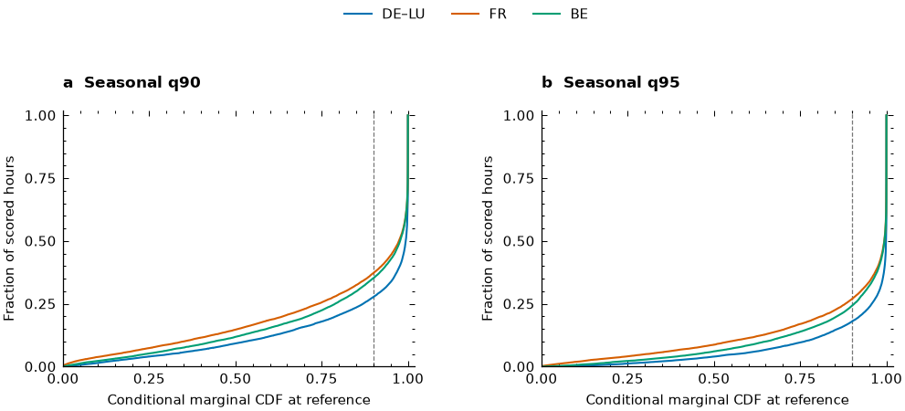
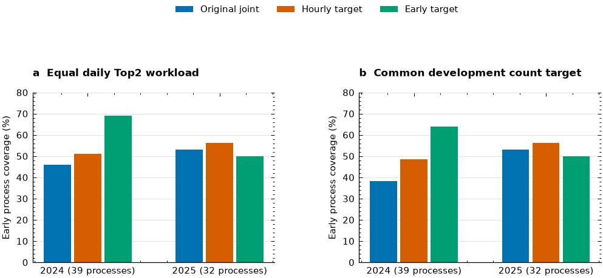

# Supporting Information

## Supplementary methods, results and reproducibility details

This document supports the Research Article on capacity-constrained joint high net load review under marginal uncertainty. All empirical results in this revision are a post hoc reanalysis of 2024 to 2025 records that had already been inspected during earlier manuscript preparation. Chronological parameter fitting is retained; the reanalysis period is not presented as newly untouched data. Tables S1 to S12 are separate machine-readable CSV files. Each CSV identifies its panel and originating result file; empty cells indicate fields belonging to another panel, not absent observations. The prose below supplies the methods and selected rows needed to interpret those files. Large cost grids and hourly prediction archives remain machine-readable rather than being printed as thousands of rows.

### S1. Event definitions, sources and marginal recalibration

For area j and delivery hour t, net load is reported load minus wind and solar production. A regional event is strict exceedance of a source-specific seasonal threshold; equality is a quiet hour. The joint hourly target is at least two regional exceedances in the monitored triple. The primary threshold is the seasonal 90th percentile, with the 95th percentile evaluated separately. Thresholds use calendar and trend terms in a rolling three year history and are fixed quarterly without using forecast weather. A q90 threshold is a monitoring level; neither a reserve shortfall nor an outage is labeled by this construction.

The triples are DE-LU/FR/BE, DE-LU/FR/DK1 and DE-LU/FR/DK2. Source accounting remains explicit: German grid load excludes pumping and photovoltaic own consumption; French metropolitan load includes network losses and excludes Corsica and pumping; Belgian control area reporting includes Sotel in southern Luxembourg. Danish accounting applies the documented own-consumption adjustment before subtracting wind and solar injection. A constant offset applied to both net load and threshold leaves exceedance unchanged. Time-varying own consumption, revisions and timestamp differences can change event membership. The joint event uses regional indicators rather than an unqualified sum of harmonized residual demand.

The preserved marginal model is an additive Gaussian location and scale model, with cubic spline bases and ridge fitting for the mean and log variance. Five quantile-position knots and penalty 10 are inherited settings, not parameters tuned in this revision. Mean and scale have separate feature roles and extrapolation rules. Raw models use expanding history from 2019, are refitted quarterly, and leave a 60-day calibration holdout before the original seven-day origin embargo. A monotone beta-CDF recalibration is updated daily over a 60-day historical window using the same quarterly raw model. Daily labels qualify by interval end at or before issue minus seven days. The released baseline therefore already contains recalibration; the factorial margin intervention is an additional conditional map, not the first introduction of calibration.

The additional map is updated weekly from 365 days of mature historical PIT values. Weather cells are fixed from 2021 forecasts. October–March is the cool season; April–September is warm. Within each season, a wind cutoff is the 2021 median common land wind and a temperature cutoff is the 2021 lower quartile. Low-wind hours are divided into colder and other hours; higher-wind hours form the third cell, giving six cells in total. No event labels set these boundaries. The beta likelihood averages log-PIT contributions within each UTC day before averaging across days. Log-shape parameters are constrained to [-3,3], with penalty 2 times their squared norm. Cells with fewer than 28 represented days or 168 finite hourly PITs retain the identity map. Labels must satisfy both interval-end and nominal-availability cutoffs at first weekly issue minus seven days. This weighting limits dominance by days with more records; it does not assume that days are independent.

The threshold-specific diagnostic is observed exceedance minus predicted exceedance, y_jt−[1−F_jt(b_jt)]. It tests the probability needed for the monitoring target, whereas PIT coverage concerns the full marginal distribution. Table S1 gives pooled and six-cell residuals, support and CDF positions. Its inherited `PIT_coverage` column is the coverage of the additional-map PIT in both path panels; it must not be read as a before/after margin comparison. Threshold residuals and the separate original/mapped PIT fields provide the corresponding path-specific diagnostics. These cell averages are descriptive calibration checks, not simultaneous confidence sets for every hourly conditional probability.

Seasonal thresholds do not occupy a fixed percentile of tomorrow's conditional distribution. On the 17,400 complete core reanalysis hours, the baseline q90 CDF positions are:

| region | below_half | below_90 | q10 | q50 | q90 |
| --- | --- | --- | --- | --- | --- |
| DE_LU | 0.092414 | 0.277644 | 0.527917 | 0.993841 | 1.000000 |
| FR | 0.147184 | 0.371897 | 0.348586 | 0.973772 | 0.999999 |
| BE | 0.118678 | 0.352241 | 0.437940 | 0.977266 | 0.999999 |

Thus high predicted weather-driven net load can put a seasonal high-load threshold below the conditional median, while other hours place it extremely close to one. Figure S1 displays the empirical distributions for both q90 and q95; it is a distribution of conditional threshold positions, not a reliability diagram.

### S2. Controlled joint probability comparison

M0 combines the preserved margins and dynamic Gaussian copula. M1 adds the weekly conditional beta map while retaining Gaussian dependence. M2 retains the original margins and substitutes Student t dependence. M3 combines the additional map and t dependence. Physical thresholds, weather summaries, samples and hourly correlation matrices are shared. Dynamic correlation uses the inherited calendar/weather basis and partial correlation construction ensuring positive definiteness. This is a controlled comparison of marginal transformation and copula family, not a separate re-estimation of each model's best correlation matrix.

The candidate degrees of freedom are {3,5,8,15,30,infinity}. Earlier q90 Brier loss averaged equally across the two margin paths selects the t candidate; the strict selection cutoff is issue minus seven days. The pre-2024 choice is three degrees of freedom and is reused for q95. Infinity denotes Gaussian dependence. A shared correlation matrix preserves pairwise Kendall dependence in these elliptical copulas while changing their joint distribution and tail behavior (Demarta and McNeil, 2005). Independence and a previously fitted direct event logistic forecast are additional simple references in the underlying archives. The principal attribution comparison is the four-cell design.

Brier loss is mean squared probability error for the specified binary target. It is not a monetary dispatch cost. The factorial interaction is BS(M3)−BS(M2)−BS(M1)+BS(M0); all differences are candidate minus reference, so negative values favor the candidate. Table S2 retains both development and reanalysis scores, reliability bins and paired contrasts. Selected core q90 scores are:

| period | model | hours | BS | event_rate |
| --- | --- | --- | --- | --- |
| development | M0 | 17160 | 0.02906421 | 0.03933566 |
| development | M1 | 17160 | 0.02855228 | 0.03933566 |
| development | M2 | 17160 | 0.02907092 | 0.03933566 |
| development | M3 | 17160 | 0.02855732 | 0.03933566 |
| reanalysis | M0 | 17400 | 0.06019061 | 0.12097701 |
| reanalysis | M1 | 17400 | 0.06059792 | 0.12097701 |
| reanalysis | M2 | 17400 | 0.06018614 | 0.12097701 |
| reanalysis | M3 | 17400 | 0.06057866 | 0.12097701 |

| candidate | reference | delta | low | high |
| --- | --- | --- | --- | --- |
| M1 | M0 | 0.00040731 | -0.00018330 | 0.00122703 |
| M2 | M0 | -0.00000447 | -0.00010895 | 0.00005898 |
| M3 | M1 | -0.00001926 | -0.00011324 | 0.00003494 |
| interaction | zero | -0.00001479 | -0.00005377 | 0.00001597 |

Reliability bins have width 0.1 and report hourly support and the number of calendar days containing events. Small bins remain descriptive rather than supporting fine conditional calibration claims. Stable reliability estimation is a distinct problem (Dimitriadis et al., 2021); CORP is not represented as an implemented estimator here. The forecast benchmark is motivated by existing weather-dependent energy covariance and conditional-extremes work (Browell and Fasiolo, 2021; Gioia et al., 2025), rather than claiming that dynamic covariance itself is new.

### S3. Numerical integration checks

Let u_j=F_jt(b_jt). For three regional indicators, the probability of at least two exceedances can be computed as 1−C12(u1,u2)−C13(u1,u3)−C23(u2,u3)+2C123(u1,u2,u3). All calculations use the same frozen marginal inputs and correlation matrices. Saturated CDF inputs are clipped to the interior [10^−12,1−10^−12] for numerical evaluation. The deterministic routine uses the inherited adaptive Gaussian/t CDF integration and normalizes the four exceedance-count probabilities after clipping within-tolerance cancellation. Correction flags record count values outside [0,1] before this normalization; a flag is not itself evidence of a materially inaccurate final event probability.

Every M0 to M3 q90 probability on the 17,400 reanalysis hours was recomputed at tolerances 10^−9 and 10^−11. The maximum Legendre order was 64. The maximum difference between stored and recomputed Brier scores was 2.0330959×10^−15; full rowwise results are authoritative in Table S3. The mapped Gaussian-minus-t Brier contrast changed by about 1.54×10^−15 between stored and tighter computations. Ordinary gate and inherited priority lists had zero symmetric differences in all eight model/rule comparisons.

An independent randomized SciPy CDF check covers 96 Gaussian/t cases drawn from q90/q95, gate-near and other strata, and all six weather cells. Each case uses three independent seeds and maxpts=524,288. The largest absolute difference from the mean randomized reference was 2.5601554e-07; the largest reference replicate standard deviation was 6.5221114e-07. Table S3 provides each seed, marginal range, correlation summary and minimum correlation eigenvalue. These are numerical convergence diagnostics for this finite three-region calculation, not certified absolute integration bounds or a statistical proof that two copulas are equivalent.

### S4. Native review contracts, utility and selection decomposition

A selected delivery hour is one review slot; it is not one hour of staff labor. For each UTC day, the capacity is at most two slots. Top1 and compulsory Top2 rank the issued joint hourly probabilities. An ordinary gate ranks the same probabilities but admits only p≥0.25, permitting zero selections. The inherited priority rule uses gate 0.19, priority p_t[1−max(p_(t−1),…,p_(t−6))], and six hour spacing between planned target hours. Earlier values in the priority calculation are previously issued forecasts. No realized process onset, future label or observed event lag enters allocation. Ties are resolved by probability and then earlier target timestamp.

For a known hourly reward v and slot cost c, maximizing the additive expected hourly reward subject to the daily capacity selects positive vp−c, with ties at zero allowed by convention. The ordinary probability gate c/v has this standard decision interpretation (Murphy, 1977; Richardson, 2000). Early process coverage has a different reward: the first selected true-event hour within the first six elapsed hours of a process contributes once; subsequent hits in that process do not add process reward. Its expected value is not obtained by summing hourly event probabilities. Fixed-gate optimality for additive hourly rewards is therefore not extended to unique early process coverage.

Write N for scored slots, H for selected event hours and C for early-covered processes. We report hourly utility H−r_hN and process utility C−r_pN, where each r is cost divided by the respective unit reward. These ratios are standardized decision preferences, not estimated euros, staff time or physical reserve costs. The full curves include non-selection and useful competitors; paired differences, pointwise intervals and fixed-grid bands appear in Table S4. A cost curve is not called a Murphy diagram: Murphy diagrams arise from a specified family of consistent scoring losses (Ehm et al., 2016), whereas these curves assess declared review rewards.

For the baseline core q90 stream, ordinary gate removes 832 of Top2's 1,450 slots, including 19 event hour hits and 813 quiet hour slots. Removed-slot hit rate is 19/832=2.28%. It retains 322/341=94.43% of the event hours selected by Top2; this is not 94.43% of all 2,105 event hours. Native early coverage decreases from 35/71 to 32/71. The difference in native process utility is −3+832r_p; the point crossing is r_p=3/832. This calculation expresses a tradeoff, not a universal recommendation for a gate.

The core q90 Top2 decomposition is 35 first early hits, 16 repeated early hits, 290 late event hits and 1,109 quiet hour reviews. Gate has 32, 15, 275 and 296 respectively. Every selected event hour belongs to exactly one category. The lost early processes begin on 9 January, 8 April and 7 October 2024; their forecast probabilities, weather and regional threshold excesses are retained in Table S4. The January process contains 129 event hours but only two true-event hours in its first six elapsed hours. Regional maximum excess over that entire process is a different quantity from excess within the early event subset.

Table S4 additionally preserves the previous native and uniform-thinning results for zero-, one- and two-empty-day process bridges and q90/q95. These were executed before this revision and are labeled separately from the new native cost evaluation. At the earlier 572-slot core q90 one-empty-day standardization, expected Top2 and gate early coverage is approximately 24.83% and 43.17%; the underlying table gives the exact fractional process counts. These quantities are expectations from randomized retention, not counts from an operational list.

The ordinary gate is a subset of Top2 under identical probabilities, eligibility and tie ordering, so it cannot increase unstandardized coverage. Earlier uniform-thinning comparisons are label-blind analytic standardizations: expected process retention is 1−choose(N−m,n)/choose(N,n), where m is that process's selected early hour count. They are not prospectively implemented budget controllers and are not the main native comparison of this revision.

The alternative workload rule sets each day's threshold from the preceding 90 forecast-complete days, after the two slot daily cap, using a minimum history of 30 days and fallback 0.25. It counts prior issued forecast vectors only and maximizes the historical retained count subject to floor(0.5×number of prior days). The grid is {0,0.01,…,0.95,0.99,1}. This rule targets average workload but cannot guarantee tomorrow's or a shifted year's average. Table S4 gives all 13 original rules, four model streams, three triples and both threshold levels, including the null rule. Core M0 representative native rows are:

| level | policy | N | hits | C | processes | slots_per_day |
| --- | --- | --- | --- | --- | --- | --- |
| q90 | none | 0 | 0 | 0 | 71 | 0.0000 |
| q90 | top1 | 725 | 179 | 26 | 71 | 1.0000 |
| q90 | top2 | 1450 | 341 | 35 | 71 | 2.0000 |
| q90 | gate025 | 618 | 322 | 32 | 71 | 0.8524 |
| q90 | inherited_priority019 | 572 | 259 | 34 | 71 | 0.7890 |
| q90 | rolling90_target05 | 358 | 234 | 24 | 71 | 0.4938 |
| q95 | none | 0 | 0 | 0 | 61 | 0.0000 |
| q95 | top1 | 725 | 100 | 25 | 61 | 1.0000 |
| q95 | top2 | 1450 | 188 | 29 | 61 | 2.0000 |
| q95 | gate025 | 405 | 166 | 25 | 61 | 0.5586 |
| q95 | inherited_priority019 | 371 | 115 | 27 | 61 | 0.5117 |
| q95 | rolling90_target05 | 353 | 140 | 23 | 61 | 0.4869 |

### S5. Same-gate rank-by-cooldown comparison

To isolate mechanisms, Table S5 crosses ordinary probability versus rising-risk priority with no spacing versus six hour spacing at the same 0.25 gate. Its secondary panel repeats the common-gate comparison at 0.19. All original stateful rules are generated across 2022 to 2025 before scoring the 2024 to 2025 period, so prior issued-risk and cooldown state cross the scoring boundary. The ordinary probability reference is therefore not compared with a differently gated priority rule as if only ranking had changed.

| policy | N | hits | C | processes |
| --- | --- | --- | --- | --- |
| gate025 | 618 | 322 | 32 | 71 |
| gate025_cool6 | 500 | 264 | 31 | 71 |
| gate025_rise | 618 | 272 | 32 | 71 |
| gate025_rise_cool6 | 509 | 253 | 33 | 71 |

Ranking by rising risk alone leaves the number of admitted reviews unchanged here but changes the hours selected. Spacing changes both admitted counts and the ranking opportunity. These are multi-objective tradeoffs: event hour hits, early process coverage and resource use must remain separate. Paired native and cost contrasts evaluate these specific policies rather than establishing a globally optimal temporal policy.

### S6. Learned early-event target and chronological fairness

The new target is z_t=1 only if the joint hourly event is true and t is within six elapsed hours of the full observed process onset. Non-event hours within that window remain zero. Process identifiers and realized onset are used to construct labels and score lists, never as input features. Both hourly and early logistic models receive identical core features: five calendar terms; issued p and logit(p); previous- and next-six hour mean/maximum risks; daily mean/maximum risk; a rising-risk term; and eight ensemble weather mean/spread summaries. Next-hour and daily summaries use only the single 24-hour target vector already available at that issue. Features never cross into the next day's unissued vector. Each UTC target day is checked to have exactly one common issue at D−1 12 UTC.

The core uses 22 features. Median imputation with missing indicators, standardization and L2 logistic fitting are learned within each training fit. Both targets use C in {0.1,1,10}, chosen by 2023 Brier, then log loss and smaller C. Initial parameter fitting uses 2022 labels with interval end at or before 2022-12-31 12 UTC minus seven days. Hyperparameter selection uses only 2023 validation labels with interval end at or before 2023-12-31 12 UTC minus seven days. The same clocks use 15 days for Danish models. This validation-label maturity is applied to C selection as well as fitting; it is not inferred merely from a correctly purged quarterly refit.

Both core targets select C=0.1 from 8,508 training hours and 8,292 mature validation hours. The common validation cutoff is 24 December 2023 at 12 UTC; all validation interval ends are at or before this cutoff. Full precision, candidate settings and timing fields are retained in Table S6.

| Target | Training positives | Validation positives | Brier | Log loss |
| --- | --- | --- | --- | --- |
| Early-event | 61 | 98 | 0.010942 | 0.049659 |
| Hourly-event | 256 | 419 | 0.038954 | 0.147897 |

Selected C remains fixed. Expanding quarterly fits in 2024 to 2025 admit only labels with interval end at or before the quarter's first issue minus seven days in the core or 15 days in Denmark. Mature earlier reanalysis labels can be used by later refits. Table S6 lists all 112 refits of 14 target/feature combinations; the first core 2024 fit uses 16,980 mature hourly records with 159 early-positive labels. Interval ends, not just interval starts, qualify. The original marginal/correlation streams are preserved; this logistic extension does not represent a new fit of the original forecasting system.

Primary resource gates are set from complete 2023 forecast vectors produced by these 2022-fitted pipelines. C selection makes 2023 a validation sample, not an independent test. Counts do not use labels, so all already issued 2023 vectors may enter even when their labels are too recent for C selection. On 357 forecast-complete days, floor(0.5×357)=178 is the count limit. Original M0, early logit and hourly logit choose gates 0.23, 0.02 and 0.05, retaining 175, 175 and 173 slots. The secondary 2022 gates for new classifiers use in-sample training-distribution predictions; they are explicitly not described as issued prequential holdout probabilities. A hardcoded 0.25 gate is not assumed suitable for the much rarer early target.

| year | n_hours | event_hours | early_event_hours | early_prior | processes | uncertain_boundary_processes |
| --- | --- | --- | --- | --- | --- | --- |
| 2022 | 8688 | 256 | 61 | 0.007021 | 25 | 0 |
| 2023 | 8472 | 419 | 98 | 0.011568 | 28 | 7 |
| 2024 | 8712 | 1415 | 132 | 0.015152 | 39 | 3 |
| 2025 | 8688 | 690 | 91 | 0.010474 | 32 | 0 |

| model | rule | gate | N | hits | C | processes |
| --- | --- | --- | --- | --- | --- | --- |
| original_M0 | top2 | 0.0000 | 1450 | 341 | 35 | 71 |
| original_M0 | count2023_target05 | 0.2300 | 642 | 324 | 32 | 71 |
| forecast_early_logit | top2 | 0.0000 | 1450 | 340 | 43 | 71 |
| forecast_early_logit | count2023_target05 | 0.0200 | 735 | 324 | 41 | 71 |
| forecast_hour_logit | top2 | 0.0000 | 1450 | 349 | 38 | 71 |
| forecast_hour_logit | count2023_target05 | 0.0500 | 823 | 341 | 37 | 71 |

The primary early count gate has 93 more reviews and nine more early-covered processes than the original 2023 count gate: paired intervals are [54,130] and [-1,18], respectively. Against the same feature hourly count gate it has 88 fewer reviews, 17 fewer event hour hits and four more early-covered processes, with intervals [-113.025,-70.975], [-39,-5] and [-4,13]. The equal workload Top2 comparison isolates target alignment without unequal N: early versus hourly Top2 adds five early-covered processes, interval [-3,13]. These intervals do not establish stable general superiority. The full declared cost grid is retained rather than selecting a favorable ratio after seeing the results.

Auxiliary learned-model cooldown variants initialize an empty spacing state at the beginning of 2024. They are preserved as secondary outputs and are not used as a warm-start comparison against the original stateful rules in S5. Principal learned-model comparisons are Top2 and count gates without cooldown.

### S7. Annual and quarterly uncertainty, workload and target-specific scores

An observed process is a cluster of active UTC days, bridging at most one fully observed inactive day; an incomplete day separates processes and marks uncertain boundaries. Each process is counted once at its first true event hour. Coverage means overlap of a pre-issued selected delivery hour with a true event within six elapsed hours after this onset. It is not a measured notification latency or a future-lookahead trigger. Process rewards are assigned to onset day for bootstrap accounting, with review costs assigned to selected delivery day.

Block resampling keeps shared forecasts and outcomes paired. Original native/forecast contrasts and primary learned contrasts use 2,000 synchronized 14-calendar-day moving-block draws stratified by year and quarter. Quarterly Brier intervals also use 2,000 draws. The auxiliary learned-model full cost grid uses 1,000 draws, recorded in its rows and manifest. These intervals condition on the saved fitted forecast streams and selection lists. The pipeline is not refitted or retuned within bootstrap draws. Process boundaries are kept intact rather than reclustered at artificial resampling seams. Inference therefore addresses fixed stream performance uncertainty, not all model-development uncertainty.

The 0.5-per-day development target is not a promised test workload: original, early and hourly 2023 count gates average 642/725, 735/725 and 823/725 scored slots per day. Table S7 supplies year/quarter counts, zero-review proportions and cap-reaching proportions for the original policies, plus annual learned-policy coverage and target-specific quarterly scores. Core annual primary count-gate rows are:

| year | model | N | hits | C | processes |
| --- | --- | --- | --- | --- | --- |
| 2024 | original_M0 | 366 | 204 | 15 | 39 |
| 2025 | original_M0 | 276 | 120 | 17 | 32 |
| 2024 | forecast_early_logit | 397 | 207 | 25 | 39 |
| 2025 | forecast_early_logit | 338 | 117 | 16 | 32 |
| 2024 | forecast_hour_logit | 437 | 216 | 19 | 39 |
| 2025 | forecast_hour_logit | 386 | 125 | 18 | 32 |

The early model's pooled count-gate advantage is concentrated in 2024 and reverses against both comparators in 2025. Figure S2 displays annual core Top2 and 2023 count-gate early coverage; it does not contain the Danish price analysis. Sparse early labels motivate reporting priors, positive counts and uncertainty alongside skill. An early target Brier score is not directly compared to an hourly event Brier score as if they were the same target. Predictions are scored against both targets with explicit names, and fixed-bin calibration diagnostics report support and observed frequencies for 2024 and 2025 separately. No outcome-conditioned policy triggering is introduced by these evaluations.

### S8. Continuous marginal-box certificates

Fix the copula and hourly correlation matrix and perturb each conditional threshold CDF within |u'_jt−u_jt|≤delta_j. Coupling the same latent uniforms makes a change in the joint indicator possible only if one regional uniform lies between its two thresholds. A union bound gives |p'_t−p_t|≤sum_j delta_j, clipped to [0,1]. This elementary inequality is used as a sensitivity envelope, not offered as a new theorem or an estimated probability confidence interval.

For this monotone event and fixed copula, all increased thresholds give the smallest probability and all decreased thresholds give the largest. Evaluating those two corners therefore supplies exact extrema of the rectangular input box up to numerical integration error. Denote the resulting probability bounds by L_t,U_t. Under ordinary gate tau and capacity K=2, a sufficient condition for certain selection is L_t≥tau and fewer than K competing daily U_s values at least L_t. A sufficient condition for certain non-selection is U_t<tau or at least K competing L_s strictly above U_t. Strict rank inequalities make these certificates safe under all tie orders. Other hours are unresolved, not proved unstable.

The certificates apply to the entire continuous marginal box for the ordinary gate, including the rank competition; they do not rely only on gate distance. For delta=0.01 and 0.03 in each area:

| delta_each_region | bound | certified_selected | certified_unselected | unresolved | baseline_early_coverage_with_at_least_one_certified_selection |
| --- | --- | --- | --- | --- | --- |
| 0.01 | union_bound | 264 | 16196 | 940 | 19 |
| 0.01 | monotone_probability_envelope | 447 | 16552 | 401 | 28 |
| 0.03 | union_bound | 54 | 15121 | 2225 | 5 |
| 0.03 | monotone_probability_envelope | 212 | 16071 | 1117 | 16 |

Table S8 gives both the union envelope and sharper monotone bounds. The baseline selected certified counts correspond to percentages reported there. They are conditional sensitivity statements under specified boxes and frozen dependence. Observed cell residuals neither establish those boxes as statistical confidence regions nor control all hourly conditional errors. Stateful rising-risk/cooldown paths are not granted a continuous box certificate by these ordinary-gate calculations.

### S9. Finite full-history scenarios and dependence-induced list changes

Eight scenarios add a constant signed delta to each of the three regional CDFs for the entire issued 2022 to 2025 history; together with the central baseline they form nine full paths for each delta. Inputs are clipped to the numerical interior. Every probability and all cooldown state are recomputed before 2024 to 2025 scoring. Table S9 reports each corner's slots, hits, early coverage, changed selection days, gained/lost early processes, gate crossings and ordinary Top2 changes. Table S8's finite summary is distinct from its continuous certificate panel.

At delta=0.03, the ordinary-gate path summary has 219 scenario-critical hours and early coverage ranging from 31 to 33; the rising-risk/cooldown summary has 333 critical hours and coverage from 34 to 36. A centre-versus-all-corners difference can occur for selection despite monotone event probabilities, because daily ranks and stateful spacing change. Invariance across these nine constant-sign paths does not certify arbitrary interior or time varying perturbations for the stateful policy.

The shared-R Gaussian/t comparison also propagates to lists. With original margins, the ordinary 0.25 gate has 38 probability-gate crossings, 18 selected-hour symmetric differences and early coverage 32 versus 31. Under mapped margins it has 47 gate crossings, 28 selected-hour differences and coverage 31 versus 31. Mean probability differences and gate-near summaries appear in Table S9. Small average loss differences therefore need not imply identical lists, while different lists need not imply detectable process-value changes.

### S10. Known-DGP simulations and boundary counterexample

The simulation follows the ADEMP structure: aims, data-generating mechanisms, estimands, methods and performance measures (Morris et al., 2019). It is explicitly synthetic, not a substitute for observed European event counts. Each of six persistence-by-weather-distribution mechanisms uses 400 paired replications of 120 days. Three daily weather states have stationary weights (0.74,0.21,0.05) or (0.56,0.32,0.12). A state persists with probability 0, 0.65 or 0.90, otherwise redrawn from the same weights. The shifted-weight experiment changes the stationary test distribution; it does not introduce within-run drift or validate a rolling controller.

For hour h, a quiet state has regional exceedance risk z=0.0002; the middle state uses z=0.315+A cos[2pi(h−10)/24]; the high state uses z=0.60+0.08 cos[2pi(h−10)/24]. With weight w=0.30 all three latent uniforms share one common draw; otherwise they are independent. Conditional joint probability is q=wz+(1−w)(3z²−2z³). These are known abstract exceedance risks, not fitted European q90 thresholds. Temporal clustering follows the simulated weather states and independent hourly latent draws; processes use the same active day gap and six hour definition.

The oracle q is compared with independent dependence and two matched marginal distortions. Near-gate locations satisfy |q−0.25|<0.025; far locations satisfy |q−0.25|>0.12 with an interior constraint on z. Each replication randomly selects equal numbers of near and far locations and applies the same signed change in all regional marginal exceedance probabilities. Replicate-level marginal MAE equality is checked before aggregation. All methods receive Top2, the 0.25 gate, and rising-risk ranking with six hour spacing at that same gate. Reported Monte Carlo standard errors are between-replication SD/sqrt(400); paired contrast MCSE is calculated from replicate-level differences, not by treating the two means as independent. Monte Carlo intervals quantify simulation noise, not empirical sampling uncertainty.

The narrow specification uses A=0.012 and shift −0.035. Selected independent-weather, baseline-weight rows are:

| model | policy | BS_mean | probability_MAE_mean | C_mean | changed_slots_mean | marginal_MAE_mean | gate_crossings_mean |
| --- | --- | --- | --- | --- | --- | --- | --- |
| margin_far | Gate | 0.051748 | 0.002247 | 2.005000 | 0.000000 | 0.001719 | 0.000000 |
| margin_near | Gate | 0.051729 | 0.002023 | 1.940000 | 23.457500 | 0.001719 | 100.067500 |

The wide counterexample uses A=0.08 and shift +0.035:

| model | policy | BS_mean | probability_MAE_mean | C_mean | changed_slots_mean | marginal_MAE_mean | gate_crossings_mean |
| --- | --- | --- | --- | --- | --- | --- | --- |
| margin_far | Gate | 0.051413 | 0.000530 | 2.972500 | 2.520000 | 0.001226 | 0.000000 |
| margin_far | Top2 | 0.051413 | 0.000530 | 2.972500 | 154.495000 | 0.001226 | 0.000000 |
| margin_near | Gate | 0.051460 | 0.001491 | 2.970000 | 0.000000 | 0.001226 | 50.430000 |
| margin_near | Top2 | 0.051460 | 0.001491 | 2.972500 | 0.000000 | 0.001226 | 0.000000 |

In that wide specification, far perturbations change Top2 ranks substantially whereas near perturbations produce no Top2 list change in these selected rows, despite changing gate membership. This counterexample prevents a claim that gate-near errors are always the most important errors. Ranking and state can dominate gate distance. Table S10 contains all mechanisms, marginal/dependence streams, policies, MCSEs and the matched near-minus-far paired contrasts, including regimes where the sign or size differs.

Two ancillary fixtures clarify identification. In a two hour example, both hourly marginals are 0.4, but the probability of at least one opportunity is 0.4 under shared occurrence and 0.64 under independent occurrence. Marginal probabilities alone cannot identify this temporal value. A separate isolated one-hour phase fixture supplies phase information to one method and a random phase to another. Its known-phase coverage is one by construction. It tests the value of supplied temporal information, not the ability to infer real process onset from the European forecasts. Both fixtures use 1,000 replications and report their own MCSEs.

#### Previously executed Gaussian/t attribution fixtures

Table S10 also preserves the earlier five-mechanism simulation, executed before this revision. It contains 100 independent repetitions per mechanism, 500 completed repetitions in total, with disjoint ordered blocks of 2,000 correlation-fit rows and 1,000 rows each for degrees-of-freedom selection, event recalibration and new evaluation. An equiprobable observed state X in {-1,+1} sets normal marginal means X(0.4,0.3,0.2) and unit variance. The event is at least two outcomes above the fixed standard-normal q90 reference. Correlations arise from partial correlation predictors (0.55,0.45,0.30)+X(0.25,0.20,0.15). Gaussian, t5 and t8 copulas retain identical conditional normal outcome margins and matched correlation matrices. The omitted-state mechanism adds an independent equiprobable state H times (0.65,0.65,0.65) to these predictors. The margin-error mechanism uses issued mean bias +0.25 and scale 0.8 while holding the true Gaussian outcomes fixed.

In that previous fixture, t degrees of freedom are selected by copula log density on a separate selection block, unlike the empirical event-Brier selection and unlike the new uniform-mixture DGP in this revision. Event recalibration is a separate nonnegative-slope penalized logistic map, fitted on the next independent block. Restoring H or correcting margins supplies diagnostic oracle information and is not a same-information competitor. Formal integration tolerance is 10^-4, with a predetermined subset recomputed at 10^-5. The paired Brier contrast is selected shared-R t minus Gaussian. Mean contrasts are +0.000001392 in the true Gaussian fixture, -0.000022155 for true t5, -0.000006149 for true t8, +0.000114475 under omitted Gaussian weather and +0.000001376 with wrong margins. Table S10 preserves the exact means, Monte Carlo SEs, intervals and selected-df counts. The omitted-weather case selected df3 in all 100 repetitions yet had worse event loss; the t5 fixture gave a measurable true finite-threshold copula benefit. These fixtures establish that the diagnostic can respond differently to genuine copula mismatch and omitted conditioning information without converting synthetic IID repetition counts into effective European weather-process information.

#### Previously executed known-state compatibility screen

The second previous fixture uses known state correlations and, under hidden weather, the exact observed-state Gaussian-mixture covariance. It separately generates calibration, candidate-selection and independent evaluation blocks. The high-information run uses 100,000, 10,000 and 100,000 rows; the lower-information run uses 10,000 rows in each block. Each contains 100 repetitions of four mechanisms. Their observations are homogeneous synthetic IID rows, not European weather processes. Six state-specific threshold-CDF intervals and two event-frequency intervals use Bonferroni Clopper–Pearson coverage; smoothed threshold estimates are (count+0.5)/(state count+1). Finite-t selection minimizes event loss averaged across two margin paths. A compatibility flag requires a Gaussian range to be disjoint from the event-frequency interval and a finite-t range to intersect it in at least one observed state. The final flag additionally requires a positive independent paired Brier-benefit t interval. That score requirement was added after an exploratory compatibility run; the completed independent-seed validation is not called preregistered.

| Mechanism | finite df /100 | compatibility /100 | validated flag /100 | flag-rate interval |
| --- | --- | --- | --- | --- |
| correct_gaussian_control | 34 | 0 | 0 | [0.0000,0.0362] |
| gaussian_margin_error | 27 | 0 | 0 | [0.0000,0.0362] |
| t5_correct_margins | 99 | 70 | 70 | [0.6002,0.7876] |
| omitted_weather_gaussian | 54 | 36 | 0 | [0.0000,0.0362] |

The hidden-weather high-information fixture yields 36 compatibility flags but no score-validated flag. The compatibility proportion 0.36 has binomial Monte Carlo SE sqrt[0.36(1−0.36)/100]=0.048. A zero count out of 100 gives an upper exact 95% rate bound about 0.0362, not a guaranteed zero-error rule. True t5 yields 70 validated flags out of 100 in the high-information run, but none in the lower-information run despite a positive mean independent benefit. All block sizes, rates, intervals and paired-gain Monte Carlo summaries are preserved in the additional Table S10 panels. These known-state experiments support distinguishing a missed conditioning state from finite-threshold copula benefit and show the cost of insufficient information. They are separate from the new spatial-uniform-mixture simulations, which investigate ranking, capacity and process-value mechanisms without fitting Gaussian/t copulas.

### S11. Danish overlap, pivotal opportunities and price comparators

Both Danish triples reuse Germany and France and are not independent regional replications. Of 1,641 DK1 and 1,826 DK2 joint event hours at q90, 924 are shared Germany–France exceedances. Danish-pivotal event hours require one of Germany/France, but not both, plus Denmark: 717 hours for DK1 and 902 for DK2. Two early endpoints are retained. The nested endpoint asks whether a Danish-pivotal event hour is selected in the original joint process's first six hours; only 45 and 54 parent processes have such opportunities. The reclustered endpoint first constructs processes from pivotal hours themselves, yielding 63 and 76 processes with different onsets. Table S11 names these endpoints separately, and full list review costs remain included in both. Late pivotal hours are not reclassified as early opportunities for the parent process.

For the market-information comparator, 2022 to 2025 official Danish day-ahead prices are joined in EUR/MWh. Elspotprices supplies hourly data through September 2025. From October 2025, DayAheadPrices supplies 15-minute market periods, with four complete quarters averaged to a UTC hour. These are auction clearing prices, not imbalance settlement prices. Delivery timestamps, dataset creation dates and last-update timestamps do not recover first publication or revised historical vintages. Documented auction closing/results times describe a market timetable but do not prove each archived API price was accessible at D−1 12 UTC. All price-based results are therefore labeled assumed-availability retrospective benchmarks.

UTC target days overlap two Europe/Copenhagen local delivery days. A price is exposed only when its local delivery date is no later than the local issue date plus one. The final one or two UTC hours otherwise need a later auction and are withheld. This excludes 2,315 hours per area across 2022 to 2025, including 1,151 across 2024 to 2025; exposed missing values use training medians and missing indicators. Daily price summaries use only eligible hours. Raw-price Top2 uses a strictly monotone ranking score and only exposed prices; the score is not treated as a calibrated probability or subjected to Brier scoring or probability-cost gates.

Price/calendar, probability/calendar and combined price/probability/calendar logistic models use common calendar terms; probability controls are identical in the base and combined variants. Both hourly and early targets follow the mature 2022-fit, 2023-C-selection and quarter-refit contract with 15 days after interval end. C is not selected from test effects. Selected equal-capacity Top2 results are:

| zone | model | N | hits | C | processes |
| --- | --- | --- | --- | --- | --- |
| DK1 | original_M0 | 1450 | 290 | 35 | 71 |
| DK1 | base_hour_logit | 1450 | 292 | 35 | 71 |
| DK1 | combined_hour_logit | 1450 | 316 | 40 | 71 |
| DK2 | original_M0 | 1450 | 321 | 40 | 75 |
| DK2 | base_hour_logit | 1450 | 321 | 41 | 75 |
| DK2 | combined_hour_logit | 1450 | 341 | 48 | 75 |
| DK1 | raw_price_rank | 1450 | 206 | 24 | 71 |
| DK2 | raw_price_rank | 1450 | 217 | 22 | 75 |

| zone | candidate | reference | difference | lower | upper |
| --- | --- | --- | --- | --- | --- |
| DK1 | combined_hour_logit__top2 | base_hour_logit__top2 | 5.000 | -1.000 | 12.000 |
| DK2 | combined_hour_logit__top2 | base_hour_logit__top2 | 7.000 | 2.000 | 13.000 |

The DK1 and DK2 combined-hourly versus base-hourly early coverage increments are conditional supplementary estimates across named regions and targets. They do not establish universally independent confirmation or remove the assumed-availability limitation. Probability-only forecasts, market-only rankings and joint features answer competing-information questions. Intraday multivariate price simulation is already represented in ASMBI (Hirsch and Ziel, 2024); this study's increment is the capacity/cost/process evaluation and marginal decision-stability analysis, not a new price copula.

### S12. Information clocks and reproducibility

The replay issue is D−1 12 UTC, using GEFS initialized D−1 00 UTC for the 24 UTC target hours. Lead times are 12–35 hours to interval start. Twelve-hour weather arrival is a replay allowance, not verified historical archive accessibility. Current provider snapshots and nominal delays do not restore every earlier measurement revision. Table S12 preserves the separate original and new maturity contracts, avoiding a blanket claim that all historical data were demonstrably visible in real time. The q90/q95 target streams, hourly probabilities, forecast completeness, truth eligibility and issued lists are available for direct recomputation.

Forecast-complete 24-hour days are determined before allocation. Missing future outcomes determine the scoring domain only afterward. Review generation therefore cannot use an oracle check that tomorrow's labels will be complete. The common 2024 to 2025 domain contains 725 days and 17,400 hours. All index timestamps and issue timestamps are UTC; price exposure uses Europe/Copenhagen only for local market-day eligibility. Source-native aggregation requires the complete set of subhourly intervals. Duplicates, missing intervals and conflicting records remain flagged rather than silently filled as outcomes.

The reproduction inventory contains input checksums, saved development and reanalysis probabilities, targets with observed process identifiers, review masks, price exposure and declared timing contracts. `training_distribution_prediction` identifies in-sample 2022 new-classifier predictions. `event` and `early_target` distinguish the binary objectives. Prediction and review files preserve the issue and delivery timestamps. The script chain comprises forecast diagnostics, numerical checks, native policy analysis, marginal stability, mechanism simulations, early/price analysis and figure generation; output tables retain their source filenames. The environment recorded for this reanalysis uses Python 3.12, NumPy 2.5.1, pandas 3.0.5, SciPy 1.18.0 and scikit-learn 1.9.0. No unsupported claim of exact recovery of vendor revisions is introduced by deterministic reproducibility.

The code and the derived evaluation data for this study are openly available in Zenodo, version 1.1.2, DOI 10.5281/zenodo.23230336 (concept DOI 10.5281/zenodo.23100588 for all versions). That record carries the revision pipeline, the derivative evaluation tables and the parameter logs for every comparison reported here. Provider material stays subject to its source terms, and the package distinguishes evaluation on the fixed forecast streams from the complete source data refitting pipeline.

### Supplementary figures

**Figure S1. Conditional positions of seasonal monitoring thresholds.** Empirical distributions of F_jt(b_jt) for the baseline marginal path on the complete 2024 to 2025 core sample, separately for q90 and q95 and each area. Reference lines identify conditional CDF positions; this is not a reliability plot.

**Figure S2. Annual early process coverage under target alignment.** Core original, hourly-logistic and early-logistic review rules under Top2 and the primary 2023 count gate. Numerators are early-covered observed processes and denominators are processes whose onset falls in each year. Danish market comparators are in Table S11.

### Supplementary references

Browell, J., and Fasiolo, M. (2021). Probabilistic Forecasting of Regional Net-Load with Conditional Extremes and Gridded NWP. IEEE Transactions on Smart Grid, 12(6), 5011–5019. https://doi.org/10.1109/TSG.2021.3107159.

Demarta, S., and McNeil, A. J. (2005). The t Copula and Related Copulas. International Statistical Review, 73(1), 111–129. https://doi.org/10.1111/j.1751-5823.2005.tb00254.x.

Dimitriadis, T., Gneiting, T., and Jordan, A. I. (2021). Stable reliability diagrams for probabilistic classifiers. Proceedings of the National Academy of Sciences, 118(8), e2016191118. https://doi.org/10.1073/pnas.2016191118.

Ehm, W., Gneiting, T., Jordan, A., and Krüger, F. (2016). Of quantiles and expectiles: Consistent scoring functions, Choquet representations and forecast rankings. Journal of the Royal Statistical Society: Series B, 78(3), 505–562. https://doi.org/10.1111/rssb.12154.

Franc, V., Prusa, D., and Voracek, V. (2023). Optimal Strategies for Reject Option Classifiers. Journal of Machine Learning Research, 24(11), 1–49. https://jmlr.org/papers/v24/21-0048.html. Selective risk and coverage contracts provide related decision-theoretic context; no reject-option classifier is claimed as a newly invented method here.

Gioia, V., Fasiolo, M., Browell, J., and Bellio, R. (2025). Additive Covariance Matrix Models: Modeling Regional Electricity Net-Demand in Great Britain. Journal of the American Statistical Association, 120(549), 107–119. https://doi.org/10.1080/01621459.2024.2412361.

Hirsch, S., and Ziel, F. (2024). Multivariate simulation based forecasting for intraday power markets: Modeling cross product price effects. Applied Stochastic Models in Business and Industry, 40(6), 1571–1595. https://doi.org/10.1002/asmb.2837.

Morris, T. P., White, I. R., and Crowther, M. J. (2019). Using simulation studies to evaluate statistical methods. Statistics in Medicine, 38(11), 2074–2102. https://doi.org/10.1002/sim.8086.

Murphy, A. H. (1977). The value of climatological, categorical and probabilistic forecasts in the cost loss ratio situation. Monthly Weather Review, 105(7), 803–816. https://doi.org/10.1175/1520-0493(1977)105<0803:TVOCCA>2.0.CO;2.

Richardson, D. S. (2000). Skill and relative economic value of the ECMWF ensemble prediction system. Quarterly Journal of the Royal Meteorological Society, 126(563), 649–667. https://doi.org/10.1002/qj.49712656313.

Tatbul, N., Lee, T. J., Zdonik, S., Alam, M., and Gottschlich, J. (2018). Precision and Recall for Time Series. Advances in Neural Information Processing Systems, 31. https://papers.nips.cc/paper_files/paper/2018/hash/8f468c873a32bb0619eaeb2050ba45d1-Abstract.html. Temporal range, existence and front-weighting evaluation are established; this study applies an explicit six hour and review cost contract.

Energinet. Elspotprices and DayAheadPrices dataset documentation. https://www.energidataservice.dk/tso-electricity/Elspotprices and https://www.energidataservice.dk/tso-electricity/DayAheadPrices. Accessed 8 October 2026.
